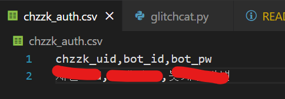
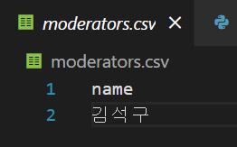
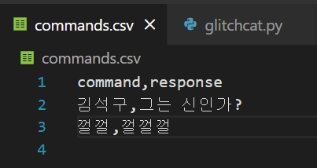

# GlitchCat

GlitchCat은 스트리밍 서비스 "치지직" 스트리머를 위한 개인 챗봇입니다.
스트리머 본인의 부계정으로 간단한 챗봇을 돌려보세요!

## 사용 방법

0. (리포지토리 복제 등의 경우) `Python3.11.x` 버전을 설치하고 `cmd`나 터미널에서 `pip install -r requirements.txt`를 통해 요구 패키지들을 설치해 줍니다.
1. `chzzk_auth.csv` 파일 (릴리즈 버전의 경우 `/_internal` 폴더 내의 해당 파일) 의 둘째 줄에 각각 연결할 채널의 UID, 봇으로 사용할 계정의 네이버 아이디, 봇으로 사용할 계정의 비밀번호를 쉼표로 구분해 한 줄에 하나씩 입력합니다.

2. `moderators.csv` 파일 (릴리즈 버전의 경우 `/_internal` 폴더 내의 해당 파일) 에 둘째 줄부터 한 줄에 하나씩 추가/삭제 명령어를 사용 가능한 관리자를 닉네임으로 추가합니다.

3. (선택) `commands.csv` 파일 (릴리즈 버전의 경우 `/internal` 폴더 내의 해당 파일) 에 둘째 줄부터 명령어, 내용을 쉼표로 구분해 한 줄에 하나씩 입력합니다. 

4. `glitchcat.py` 또는 릴리즈 버전의 경우 `glitchcat.exe`를 실행 (안 되면 관리자 권한으로) 하면 크롬 브라우저에서 챗봇이 돌아갑니다. (자동 로그인/2차 인증 기능은 해제 필요)
5. **반드시 봇 계정이 채팅을 칠 수 있는 상태인지 확인해 주세요.** 채널 규칙이나 약관 동의 등 창이 나오면 최초 1번만 확인을 눌러줘서 정상적으로 채팅이 되게 합니다. 
6. 관리자로 등록되어 있다면 `!추가 (명령어) (내용)`으로 명령어 추가를, `!삭제 (명령어) (내용)`으로 명령어 삭제를 할 수 있습니다. 그 외의 명령어는 모두가 사용 가능합니다.

## 주의사항

- 약 5초에 1번씩 프로그램이 연결된 크롬 브라우저를 확인하며 명령어 실행 여부를 결정합니다. 창을 닫지 마세요!
- 잘못된 입력값이나 오동작이 있을때 종료됩니다. 에러 로그를 개발자에게 전달해 주시면 개선에 도움이 됩니다!

## Contact

<rokja97@naver.com>